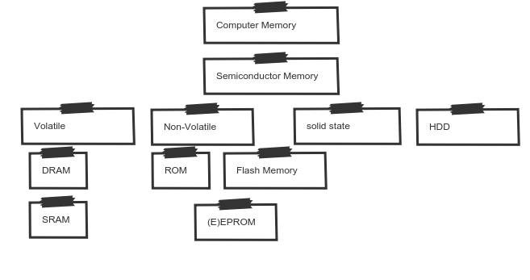

# Memory
Some notes about memory types, management, hardware, etc.

# General Notes
  * What is computer memory?
    - Typically, computer memory refers to the devices that is a computer's "primary storage" device (non-volative). A computer uses memory for holding information about it's current tasks/jobs, thus access, ideally, should be quick and inexpensive.
  * [how much memory is my process using - Julia Evans](https://jvns.ca/blog/2016/12/03/how-much-memory-is-my-process-using-/)
  * [Virtual Memory](https://en.wikipedia.org/wiki/Virtual_memory)
    - Map virtual/logical addresses to physical addresses via implementations in software & hardware.
    - CPUs have Memory Management Units for virtual memory to be effective in translating addresses timely.
    - Things that cause immediate virtual memory allocation:
        - thread stacks (ex. pthreads by default have 8MB stack size, in virtual memory)
        -
  * Fragmentation
    - Internal - when more memory is allocated than needed - for example, a
        small program that doesn't need much memory has to at least allocate a X
        block size of memory, even though it may not need the entire block
    - External - when the free and allocated blocks of memory are intertwined -
        memory management algorithms have problems with this
  * Flash Memory
    - [wikiArticle](https://en.wikipedia.org/wiki/Flash_memory) - "is an electronic (solid-state) non-volatile computer storage medium that can be electrically erased and reprogrammed."
  * SRAM
    * uses 4 to 6 transistors per bit
    * very fast & expensive,
    * often used as CPU cache
  * DRAM
    * dynamic, needs refreshing
    * one capacitor & one transistor per bit (high density)
        

# Resources/Good Reads
* [Anatomy of a Program in Memory](https://manybutfinite.com/post/anatomy-of-a-program-in-memory/)
