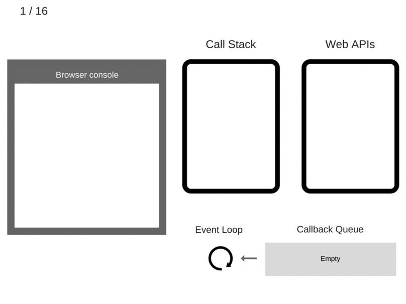

# javascript
Some notes about the "language of the Internet".

## general notes
* javascript is a multi-paradigm language
    * paradigms: object-oriented (prototype-based), imperative, functional
    * dynamic and weakly typed
    * type system: dynamic, duck
    * interpreted language
* created by Mozilla
* it was named javascript because of the populate lingo "java" - but has
    nothing to do with Java.
    * standardized as ECMAScript
* initially implemented for client-side browsing, but now it has expanded to be
    used in many other ways:
    * mobile applications
    * server-side apps
    * non-web programs like word processor and PDF software
* javascript is used alongside CSS and HTML to create webpages/web apps
* it relies on a run-time environment to provide interface to the environment it
    is running in (this is typically your browser)
* JSON = JavaScript *Object* Notation
* functions are first-class in JS

## Object-orientation
* Prototypal inheritance in JavaScript is described by Douglas Crockford as: "You make prototype objects, and then … make new instances. Objects are mutable in JavaScript, so we can augment the new instances, giving them new fields and methods. These can then act as prototypes for even newer objects. We don't need classes to make lots of similar objects… Objects inherit from objects. What could be more object oriented than that?" - [from wikipedia](https://en.wikipedia.org/wiki/JavaScript#Object-orientation_(prototype-based))
* Class-based vs Prototype-based
  * "In prototype-based languages the objects are the primary entities. No classes even exist. The prototype of an object is just another object to which the object is linked. Every object has one prototype link (and only one). New objects can be created based on already existing objects chosen as their prototype. You may call two different objects apple and orange a fruit, if the object fruit exists, and both apple and orange have fruit as their prototype. The idea of the fruit class doesn't exist explicitly, but as the equivalence class of the objects sharing the same prototype. The attributes and methods of the prototype are delegated to all the objects of the equivalence class defined by this prototype. The attributes and methods owned individually by the object may not be shared by other objects of the same equivalence class; e.g. the attribute sugar_content may be unexpectedly not present in apple. Only single inheritance can be implemented through the prototype." - [wikipedia](https://en.wikipedia.org/wiki/Object-oriented_programming#Class-based_vs_prototype-based)
* [developer.mozilla.com - Details of the Object Model](https://developer.mozilla.org/en-US/docs/Web/JavaScript/Guide/Details_of_the_Object_Model)
  * "JavaScript classes, introduced in ECMAScript 2015, are primarily syntactical sugar over JavaScript's existing prototype-based inheritance. The class syntax does not introduce a new object-oriented inheritance model to JavaScript."
* Good stackoverflow posts:
  * [Stackoverflow - What does it mean that javascript is a prototype-based language?](https://stackoverflow.com/questions/186244/what-does-it-mean-that-javascript-is-a-prototype-based-language)
  * [What techniques can be used to define a class in JavaScript, and what are their trade-offs?](https://stackoverflow.com/questions/387707/what-techniques-can-be-used-to-define-a-class-in-javascript-and-what-are-their)

### the event loop
* [How The Javascript Event Loop Works](https://blog.sessionstack.com/how-javascript-works-event-loop-and-the-rise-of-async-programming-5-ways-to-better-coding-with-2f077c4438b5)
  * "The Event Loop has one simple job — to monitor the Call Stack and the Callback Queue. If the Call Stack is empty, it will take the first event from the queue and will push it to the Call Stack, which effectively runs it."

### functional programming in javascript
* main concepts of functional programming:
    * pure functions
    * function composition
    * avoid shared state
    * avoid mutating state
    * no side-effects
* map, filter & reduce

## references
* [Wikipedia Article - Javascript](https://en.wikipedia.org/wiki/JavaScript)
* [A re-introduction to JavaScript - Mozilla](https://developer.mozilla.org/en-US/docs/Web/JavaScript/A_re-introduction_to_JavaScript)
* [An Introduction to Functional Programming - Mary Rose Cook](https://codewords.recurse.com/issues/one/an-introduction-to-functional-programming)
* [Mastering the JavaScript Interview](https://medium.com/javascript-scene/master-the-javascript-interview-what-is-functional-programming-7f218c68b3a0)
* [Mostly Adequate Guide to Functional Programming](https://github.com/MostlyAdequate/mostly-adequate-guide)

## videos & examples
### Example 1 - Build a Bookmarker Application in Javascript
This example goes through how to build a web application that saves bookmarks
for you. It uses [bootstrap](https://getbootstrap.com/) to quickly get up and
running with a theme for your web page. It then sets up a basic HTML page and
builds javascript to interact with the user and use HTML local storage APIs
(which is part of the HTML basic language) to store some basic data.
* [Youtube - Learn JavaScript By Building A Bookmarker Application](https://www.youtube.com/watch?v=DIVfDZZeGxM)

### videos
* [Youtube - Functional Programming with Javascript](https://www.youtube.com/watch?v=e-5obm1G_FY)

# Document Object model
* An API to interact with the structure of a webpage (ex. HTML) or document (ex. XML)
* [Wikipedia - Document Object Model](https://en.wikipedia.org/wiki/Document_Object_Model)

# HTML
* [Wikipedia - HTML](https://en.wikipedia.org/wiki/HTML)
